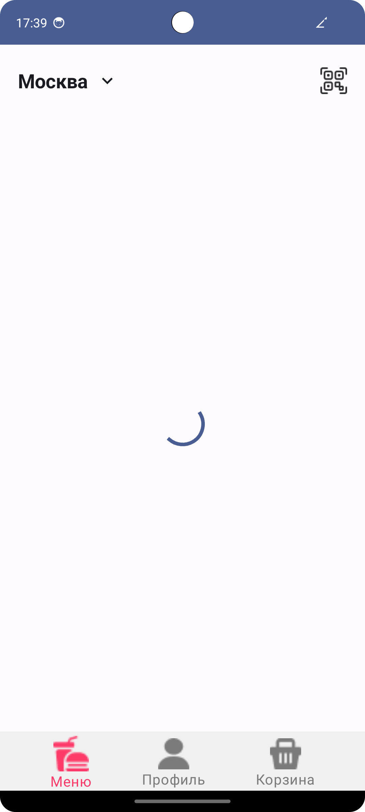
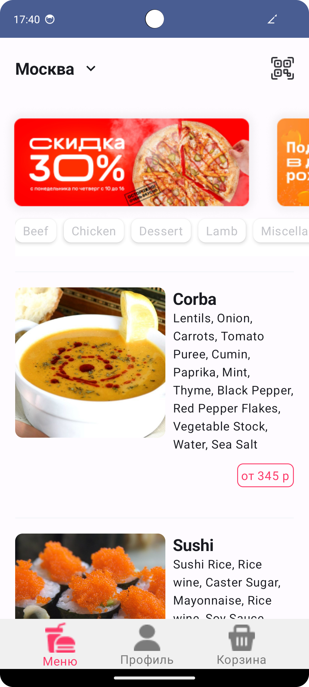
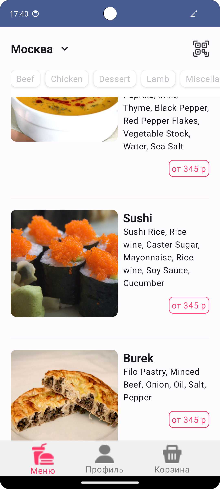

# Delivery Android Application
---
Простое Android-приложение позволяющее просматривать еду.

## Содержание

1. [Задача](#задача)
2. [Функциональность](#функциональность)
3. [Требования](#требования)
4. [Используемые технологии](#используемые-технологии)
5. [API](#api)
6. [Начало работы](#начало-работы)
7. [Как использовать](#как-использовать)
8. [Скриншоты](#скриншоты)

## Задача

Разработать мобильное приложение для просмотра еды. Приложение должно получать данные о товарах с помощью API и предоставлять удобный интерфейс для их просмотра.

## Функциональность

- Просмотр списка всей еды.
- Просмотр категорий еды.
- Просмотр еды по выбранным категориям.
- Получение данных о товарах с использованием Retrofit.
- Получение сохраненных данных при последней загрузке в оффлайн режиме из локальной базы данных
- Управление зависимостями с помощью Hilt-Dagger.
- Отображение изображений товаров с помощью Glide.
- Использование Jetpack Compose для построения пользовательского интерфейса.
- Обновление данных в реальном времени с использованием StateFlow.

## Требования

- Android устройство с версией Android 5.0 (API уровень 24) и выше.
- Стабильное интернет-соединение.

## Используемые технологии

- Kotlin
- Hilt-Dagger
- Retrofit
- Glide
- Jetpack Compose
- StateFlow
- Room

## API

URL для получения списка еды: `https://themealdb.com/api/json/v1/1/search.php?s`

URL для получения списка категорий еды: `https://themealdb.com/api/json/v1/1/categories.php`


## Начало работы

1. Клонируйте репозиторий на свой компьютер.
```bash
git clone https://github.com/kroshkaenot1/Delivery.git
```
2. Откройте проект в вашей среде разработки.
3. Убедитесь, что все зависимости установлены с помощью Gradle.

## Как использовать

1. Запустите приложение на своем Android устройстве или эмуляторе.
2. Перейдите на главный экран приложения, чтобы просмотреть список еды.
4. Воспользуйтесь выбором категорий для фильтрации еды.

## Скриншоты

Точка старта приложения - экран со списком еды






Доступно отображение еды по фильтру категорий

